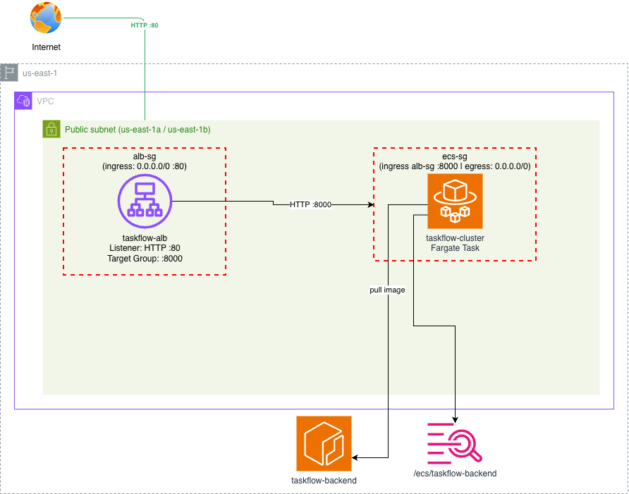

# taskflow-infra

Terraform IaC for the DevOps pipeline demo at **AWS Summit São Paulo 2026** - *"Do Localhost à Nuvem: DevOps para Quem Está Começando"*.

> Application: [taskflow-app](https://github.com/jhermesn/taskflow-app)

## Architecture



## Setup

```bash
# 1. Apply bootstrap (temporary AWS credentials):
terraform -chdir=_bootstrap init && terraform -chdir=_bootstrap apply

# 2. Set GitHub secrets from bootstrap outputs:
#    infra_deploy_role_arn → AWS_DEPLOY_ROLE_ARN  (taskflow-infra environments)
#    app_deploy_role_arn   → APP_DEPLOY_ROLE_ARN  (taskflow-app environments)

# 3. Run "Provision Infrastructure - DEV/PROD" workflow

# 4. Copy provision outputs to taskflow-api environment secrets
```

## Workflows

| Workflow | Trigger |
|----------|---------|
| `provision-dev` / `provision-prod` | manual |
| `enable-dev` / `enable-prod` | manual |
| `disable-dev` / `disable-prod` | manual |
| `destroy-dev` / `destroy-prod` | manual |

## Per-environment secrets/variables

**Settings → Environments → `dev` / `prod`:**

| Name | Type |
|------|------|
| `AWS_DEPLOY_ROLE_ARN` | Secret |
| `AWS_REGION` | Variable |
